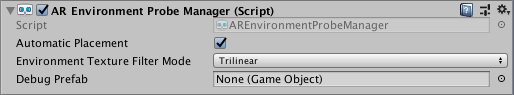

# AR environment probe manager

The environment probe manager is a type of [trackable manager](trackable-managers.md).

Environment probes are a technique of capturing real-world imagery from the device’s camera and organizing that information into an environment texture, such as a cube map, that contains the view in all directions from a certain point in the scene. Rendering 3D objects using this environment texture allows for real-world imagery to be reflected in the rendered objects, which creates realistic reflections and lighting of virtual objects as influenced by the real-world views.

For more details, see the [Environment Probe Subsystem](http://docs.unity3d.com/Packages/com.unity.xr.arsubsystems@latest?preview=1&subfolder=/manual/environment-probe-subsystem.html) documentation.

Environment probes can be placed manually, automatically, or using both methods.

## Manual placement

To create an environment probe, call `AREnvironmentProbeManager.AddEnvironmentProbe`. Like [anchors](anchor-manager.md), the resulting `AREnvironmentProbe` might be in a "pending" state for a few frames.

To remove an environment probe, call `AREnvironmentProbeManager.RemoveEnvironmentProbe`. **Note:** Do not `Destroy` an `AREnvironmentProbe` unless its manager has already been destroyed.

## Automatic placement

With automatic environment probe placement, the device automatically selects suitable locations for environment probes and creates them.

Environment probes can be created in any orientation. However, Unity's reflection probes, which consume the environment probe data, only support axis-aligned orientations. This means the orientation you specify (or your application selected automatically) might not be fully respected.

## Texture filter mode

This corresponds to the [UnityEngine.FilterMode](https://docs.unity3d.com/ScriptReference/FilterMode.html) for the cubemap that the environment probe generates.

## Debug prefab

This prefab will be instantiated for each manually or automatically placed environment probe. This is not required, but Unity provides it for debugging purposes.
