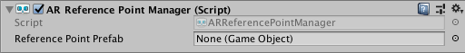

# AR anchor manager

The anchor manager is a type of [trackable manager](trackable-managers.md).



The anchor manager creates `GameObject`s for each anchor. An anchor is a particular point in space that you want the device to track. The device typically performs additional work to update the position and orientation of the anchor throughout its lifetime. Because anchors are generally resource-intensive objects, you should use them sparingly.

## Adding and removing anchors

To add or remove anchors, call `AddAnchor` or `RemoveAnchor` on the `ARAnchorManager` component in script. In some scenarios, you can create anchors in other ways, such as loading an AR World Map on ARKit which includes saved anchors.

When you add an anchor, it might take a frame or two before the anchor manager's `anchorsChanged` event reports it as added. During the time between being added and being reported as added, the anchor will be in a "pending" state. You can query for this with the `ARAnchor.pending` property.

Likewise, when you remove an anchor, it might take a frame before `anchorsChanged` reports it as removed. If you remove an anchor before it's reported as added, you won't receive any events for it.

You should always remove anchors through the anchor manager. Don't `Destroy` an `ARAnchor` unless its manager has also been destroyed.

## Attaching anchors

You can also create anchors that are attached to a plane. The following `ARAnchorManager` component does this:

```csharp
public ARAnchor AttachAnchor(ARPlane plane, Pose pose)
```

Attaching an anchor to a plane affects the anchor update semantics. Anchors can only change their position along the normal of the plane they are attached to, which means they effectively maintain a constant distance from the plane.
