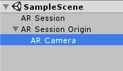
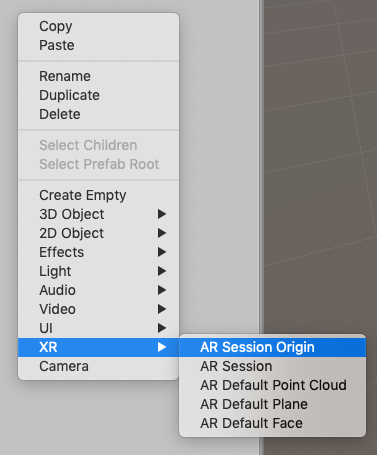
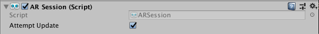
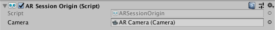
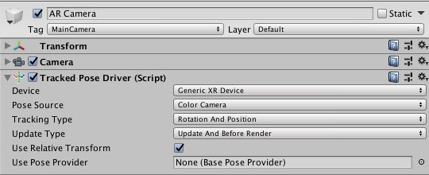
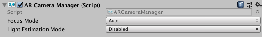
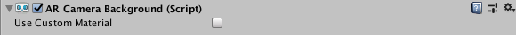
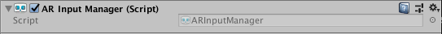
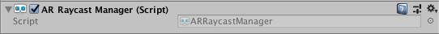

# About AR Foundation

AR Foundation allows you to work with augmented reality platforms in a multi-platform way within Unity. This package presents an interface for Unity developers to use, but doesn't implement any AR features itself. To use AR Foundation on a target device, you also need a separate package for that platform (for example, `ARKit XR Plugin` on iOS or `ARCore XR Plugin` on Android).

AR Foundation is a set of `MonoBehaviour`s and APIs for dealing with devices that support the following concepts:

- World tracking: track the device's position and orientation in physical space.
- Plane detection: detect horizontal and vertical surfaces.
- Point clouds, also known as feature points.
- Anchor: an arbitrary position and orientation that the device tracks.
- Light estimation: estimates for average color temperature and brightness in physical space.
- Environment probe: a means for generating a cube map to represent a particular area of the physical environment.
- Face tracking: detect and track human faces.
- Image tracking: detect and track 2D images.

If you are migrating from AR Foundation 1.0, see the [Migration Guide](migration-guide.md).

## Subsystems

AR Foundation is built on subsystems. A **subsystem** is a platform-agnostic interface for surfacing different types of information. The AR-related subsystems are defined in the [`AR Subsystems`](https://docs.unity3d.com/Packages/com.unity.xr.arsubsystems@latest?preview=1&subfolder=/manual/) package and use the namespace `UnityEngine.XR.ARSubsystems`. You will occasionally need to interact with the types in the AR Subsystems package.

Each subsystem handles specific functionality. For example, `XRPlaneSubsystem` provides the plane detection interface.

### Providers

A **provider** is a concrete implementation of a subsystem. For example, the `ARCore XR Plugin` package contains the ARCore implementation for many of the AR subsystems.

Because different providers have varying support for specific features, each subsystem also has a descriptor that indicates which specific subsystem features it supports. For example, the `XRPlaneSubsystemDescriptor` contains properties indicating whether it supports horizontal or vertical plane detection.

Each individual provider determines how to implement each subsystem. In general, they wrap that platform's native SDK (for example, ARKit on iOS and ARCore on Android).

# Installing AR Foundation

To install this package, follow the instructions in the [Package Manager documentation](https://docs.unity3d.com/Packages/com.unity.package-manager-ui@latest/index.html).

Subsystems are implemented in other packages. To use AR Foundation, you must also install at least one of these platform-specific AR packages from the Package Manager window (menu: **Window &gt; Package Manager**):

 - ARKit XR Plugin
 - ARCore XR Plugin

# Glossary

| **Term** | **Description** |
|-|-|
| **Tracking** | The AR device's ability to determine its relative position and orientation in the physical world. If the environment is too dark, for example, the device might "lose tracking", which means it can no longer accurately report its position. |
| **Trackable** | A real-world feature, such as a planar surface, that the AR device tracks and/or detects. |
| **Feature Point** | A specific point in a point cloud. An AR device uses the device’s camera and image analysis to track specific points in the world, and uses these points to build a map of its environment. These are usually high-frequency elements, such as a knot in a wood-grain surface.|
| **Session** | An AR instance. |
| **Session Space** | The coordinate system relative to the beginning of the AR session. For example, session space (0, 0, 0) refers to the position at which the AR session was created. An AR device typically reports trackables and tracking information relative to its session origin.|

# Using AR Foundation

## Samples

For examples, see the [ARFoundation Samples](https://github.com/Unity-Technologies/arfoundation-samples) GitHub repository.

## Basic setup

A basic AR scene hierarchy looks like this:



To create these scenes automatically, right-click in the scene hierarchy, and select **XR &gt; AR Session** or **XR &gt; AR Session Origin** from the context menu.



The required components are explained in more detail below.

### ARSession

An AR scene should include an `ARSession` component. The AR Session controls the lifecycle of an AR experience by enabling or disabling AR on the target platform. The `ARSession` can be on any `GameObject`.



When you disable the `ARSession`, the system no longer tracks features in its environment, but if you enable it at a later time, the system will attempt to recover and maintain previously-detected features.

If you enable the **Attempt Update** option, the device tries to install AR software if possible. Support for this feature is platform-dependent.

**Note:** An AR session is a global construct. An `ARSession` component manages this global session, so multiple `ARSession` components will all try to manage the same global session.

#### Checking for device support

Some platforms might support a limited subset of devices. On these platforms, your application needs to be able to detect support for AR Foundation so it can provide an alternative experience when AR is not supported.

The `ARSession` component has a static coroutine that you can use to determine whether AR is supported at runtime:

```csharp
public class MyComponent {
    [SerializeField] ARSession m_Session;

    IEnumerator Start() {
        if ((ARSession.state == ARSessionState.None ||)
            (ARSession.state == ARSessionState.CheckingAvailability))
        {
            yield return ARSession.CheckAvailability();
        }

        if (ARSession.state == ARSessionState.Unsupported)
        {
            // Start some fallback experience for unsupported devices
        }
        else
        {
            // Start the AR session
            m_Session.enabled = true;
        }
    }
}
```

#### Session state

To determine the current state of the session (for example, whether the device is supported, if AR software is being installed, and whether the session is working), use `ARSession.state`. You can also subscribe to an event when the session state changes: `ARSession.stateChanged`.

|`ARSessionState`|**Description**|
|-|-|
|`None`|The AR System has not been initialized and availability is unknown.|
|`Unsupported`|The current device doesn't support AR.|
|`CheckingAvailability`|The system is checking the availability of AR on the current device.|
|`NeedsInstall`|The current device supports AR, but AR support requires additional software to be installed.|
|`Installing`|AR software is being installed.|
|`Ready`|AR is supported and ready.|
|`SessionInitialized`|An AR session is initializing (that is, starting up). This usually means AR is working, but hasn't gathered enough information about the environment.|
|`SessionTracking`|An AR session is running and is tracking (that is, the device is able to determine its position and orientation in the world).|

### ARSessionOrigin



The purpose of the `ARSessionOrigin` is to transform trackable features, such as planar surfaces and feature points, into their final position, orientation, and scale in the Unity Scene. Because AR devices provide their data in "session space", which is an unscaled space relative to the beginning of the AR session, the `ARSessionOrigin` performs the appropriate transformation into Unity space.

This concept is similar to the difference between "model" or "local" space and world space when working with other Assets in Unity. For instance, if you import a house Asset from a DCC tool, the door's position is relative to the modeler's origin. This is commonly called "model space" or "local space". When Unity instantiates it, it also has a world space that's relative to Unity's origin.

Likewise, trackables that an AR device produces, such as planes, are provided in "session space", relative to the device's coordinate system. When instantiated in Unity as `GameObject`s, they also have a world space. In order to instantiate them in the correct place, AR Foundation needs to know where the session origin should be in the Unity scene.

`ARSessionOrigin` also allows you to scale virtual content and apply an offset to the AR Camera. If you're scaling or offsetting the `ARSessionOrigin`, then its AR Camera should be a child of the `ARSessionOrigin`. Because the AR Camera is session-driven, this setup allows the AR Camera and detected trackables to move together.

#### Scale

To apply scale to the `ARSessionOrigin`, set its `transform`'s scale. This has the effect of scaling all the data coming from the device, including the AR Camera's position and any detected trackables. Larger values make AR content appear smaller. For example, a scale of 10 would make your content appear 10 times smaller, while 0.1 would make your content appear 10 times larger.

### Tracked Pose Driver

The AR Camera, which will be used to render any trackables you wish to visualize, should be parented to the `ARSessionOrigin`'s `GameObject`. The AR Camera should also have a `TrackedPoseDriver` component on it to drive the AR Camera’s local position and orientation according to the device's tracking information. This setup allows the AR Camera’s local space to match the AR "session space".



### AR Camera manager

The `ARCameraManager` enables features for the AR Camera, including the management of the device camera textures and the properties that set the light estimation modes.



| **Setting** | **Function** |
|-|-|
| **Focus Mode** | Can be *Auto* or *Fixed*. *Auto* enables the hardware Camera's automatic focus mode, while *Fixed* disables it (the focus is fixed and doesn't change automatically). |
| **Light Estimation** | Can be *Disabled* or *Ambient intensity*. If not disabled, this instructs the platform to produce light estimation information. This estimates the average light intensity and color in the physical environment and can affect performance, so disable it if your application doesn't use it.|

### AR Camera background

If you want the video feed from the device camera to show up as the rendered background of the scene at runtime, you need to add an `ARCameraBackground` component to a Camera. Otherwise, the background at runtime will come from the `Camera.clearFlags` setting. The `ARCameraBackground` component subscribes to AR Camera events and renders the AR Camera texture to the screen (that is, the background texture from the device camera must be rendered for each frame). This is not required, but common for AR apps.



The `Custom Material` property is optional, and typically you don't need to set it. The platform-specific packages that Unity provides, such as ARCore and ARKit, contain their own shaders for background rendering.

If `Use Custom Material` is `true`, the `ARCameraBackground` uses the `Material` you specify for background rendering.

If you have exactly one `ARSessionOrigin`, you only need to add the `ARCameraBackground` to that Camera. If you have multiple `ARSessionOrigin`s (for example, to selectively render different content at different scales), you should use separate Cameras for each `ARSessionOrigin` and a separate, single AR Camera for the `ARCameraBackground`.

#### Configuring ARCameraBackground with the Universal Render Pipeline (URP)

Please refer to [this additional documentation to configure an AR Foundation project with a URP](ar-camera-background-with-scriptable-render-pipeline.md).

#### Copying the Camera Texture to a Render Texture when accessing the camera image on the GPU

Camera Textures are likely [external Textures](https://docs.unity3d.com/ScriptReference/Texture2D.CreateExternalTexture.html) and might not last beyond a frame boundary. It can be useful to copy the Camera image to a [Render Texture](https://docs.unity3d.com/Manual/class-RenderTexture.html) to persist it or process it further. The following code blits the Camera image to a Render Texture of your choice:

```csharp
Graphics.Blit(null, m_MyRenderTexture, m_ARBackgroundCamera.material);
```


### Accessing the Camera Image on the CPU

See documentation on [camera images](cpu-camera-image.md).

### AR input manager

This component is required to enable world tracking. Without it, the Tracked Pose Driver can't acquire a pose for the device.

This component can be anywhere in your Scene, but you shouldn't have more than one.



### Trackable managers

See documentation on [trackable managers](trackable-managers.md).

### Visualizing trackables

Trackable components don't do anything on their own; they just contain data associated with each trackable. There are many ways to visualize trackables, so AR Foundation includes some visualizers that you can use for debugging or as a starting point to create a visualizer suitable for your application.

## Ray casting

Also known as hit testing, ray casting allows you to determine where a ray (defined by an origin and direction) intersects with a trackable. The current ray cast interface only tests against planes and points in the point cloud. The ray casting interface is similar to the one in the Unity Physics module, but since AR trackables may not necessarily have a presence in the physics world, AR Foundation provides a separate interface.

To perform a ray cast, add an `ARRaycastManager` to the same `GameObject` as the `ARSessionOrigin`.



There are two ray casting methods on the `ARRaycastManager`:

```csharp
public bool Raycast(Vector2 screenPoint, List<ARRaycastHit> hitResults, TrackableType trackableTypeMask = TrackableType.All);
public bool Raycast(Ray ray, List<ARRaycastHit> hitResults, TrackableType trackableTypeMask = TrackableType.All, float pointCloudRaycastAngleInDegrees = 5f);
```

The first method takes a two-dimensional position on the screen. You can, for example, pass a touch position directly:

```csharp
var raycastManager = GetComponent<ARRaycastManager>();
raycastManager.Raycast(Input.GetTouch(0).position, ...);
```

The second method takes an arbitrary `Ray` (a position and direction).

The following table summarizes the other parameters:

| **Parameter** | **Description** |
|-|-|
| `hitResults` | The results for both methods are stored in this `List`, which must not be `null`. This lets you reuse the same `List` object to avoid garbage-collected allocations. |
| `trackableTypeMask` | The type(s) of trackable(s) to hit test against. This is a flag, so multiple types can be bitwise OR'd together, for example, `TrackableType.PlaneWithinPolygon` &#124; `FeaturePoint` |

# Technical details

## Requirements

This version of AR Foundation is compatible with the following versions of the Unity Editor:

* 2019.2 and later

## Known limitations

AR Foundation includes the following known limitations:

* No known issues

## Document revision history

|Date|Reason|
|---|---|
|April 18, 2019|Update documentation to include new features (environment probes, image tracking, face tracking, object tracking).|
|March 4, 2019|Update documentation to reflect 2.0.0 changes.|
|November 15, 2018|Face Tracking added.|
|July 25, 2018|Update `ARCameraBackground` image and description following refactor.<br/>Add howto section for blitting the camera image to a render texture.|
|July 16, 2018|Additional explanation for `ARSessionOrigin`|
|June 14, 2018|Update `ARSessionOrigin` photos|
|June 12, 2018|Update `ARPlaneMeshVisualizer` and `ARPointCloudMeshVisualizer` with additional debug recommendations and standards.|
|June 7, 2018|Remove known issue.|
|June 6, 2018|Update ARSession image.|
|April 25, 2018|Updated docs and screen shots after package rename.|
|April 19, 2018|Updated screen shots and information after code changes. Added section on `ARBackgroundRenderer` component. |
|April 10, 2018|Document created.|
