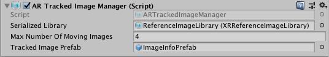

# AR tracked image manager

The tracked image manager is a type of [trackable manager](trackable-managers.md).



The tracked image manager creates `GameObject`s for each detected image in the environment. Before an image can be detected, the manager must be instructed to look for a set of reference images compiled into a reference image library. It only detects images in this library.

## Reference library

For instructions on how to create a reference image library in the Unity Editor, see documentation on the [Tracked Image Subsystem](http://docs.unity3d.com/Packages/com.unity.xr.arsubsystems@latest?preview=1&subfolder=/manual/image-tracking.html).

The reference image library can be set at runtime, but as long as the tracked image manager component is enabled, the reference image library must be non-null. You can set it via script with:

```csharp
ARTrackedImageManager manager = ...;
manager.referenceLibrary = myReferenceImageLibrary;
```

You can set the reference image library to be either an `XRReferenceImageLibrary` or a `RuntimeReferenceImageLibrary`. You can only create an `XRReferenceImageLibrary` in the Editor, and you can't modify it at runtime. A `RuntimeReferenceImageLibrary` is the runtime representation of an `XRReferenceImageLibrary`. When you set the library to be an `XRReferenceImageLibrary`, the image tracking subsystem automatically converts it to a `RuntimeReferenceImageLibrary` for consumption.

The actual image library data is provider-specific; refer to your provider's documentation for details.

You can create a `RuntimeReferenceImageLibrary` from an `XRReferenceImageLibrary` with the [`ARTrackedImageManager.CreateRuntimeLibrary`](../api/UnityEngine.XR.ARFoundation.ARTrackedImageManager.html#UnityEngine_XR_ARFoundation_ARTrackedImageManager_CreateRuntimeLibrary_XRReferenceImageLibrary_) method:

```csharp
XRReferenceImageLibrary serializedLibrary = ...
RuntimeReferenceImageLibrary runtimeLibrary = trackedImageManager.CreateRuntimeLibrary(serializedLibrary);
```

## Adding new reference images at runtime

Some subsystems might support image libraries that are modifiable at runtime. In this case, the subsystem produces a `RuntimeReferenceImageLibrary` that is a `MutableRuntimeReferenceImageLibrary`. To use it, you need to cast the `RuntimeReferenceImageLibrary` to a `MutableRuntimeReferenceImageLibrary`:

```csharp
if (trackedImageManager.referenceLibrary is MutableRuntimeReferenceImageLibrary mutableLibrary)
{
    // use the mutableLibrary
}
```

To create an empty library that you can add images to later, you can call `CreateRuntimeLibrary` without arguments:

```csharp
var library = trackedImageManager.CreateRuntimeLibrary();
if (library is MutableRuntimeReferenceImageLibrary mutableLibrary)
{
    // add images to mutableLibrary
}
```

You can check whether a particular tracked image manager supports mutable libraries with its descriptor:

```csharp
if (trackedImageManager.descriptor.supportsMutableLibrary)
{
    // Mutable reference image libraries are supported
}
```

You can add images to mutable libraries allow images at any time. Adding an image can be computationally expensive, and might take a few frames to complete. The [Unity Job System](https://docs.unity3d.com/Manual/JobSystem.html) is used to process images asynchronously.

To add an image to a `MutableRuntimeReferenceImageLibrary`, use the [`ScheduleAddImageJob`](../api/UnityEngine.XR.ARFoundation.MutableRuntimeReferenceImageLibraryExtensions.html#UnityEngine_XR_ARFoundation_MutableRuntimeReferenceImageLibraryExtensions_ScheduleAddImageJob_MutableRuntimeReferenceImageLibrary_Texture2D_System_String_System_Nullable_System_Single__JobHandle_) method. This returns a `JobHandle` that you can use to determine when the job is complete. You can safely discard this handle if you don't need to do this.

Multiple add image jobs can be processed concurrently. Whether or not `MutableRuntimeReferenceImageLibrary` is currently in use for image tracking has no effect on this.

## Creating a manager at runtime

When you add a component to an active `GameObject` at runtime, Unity immediately invokes its `OnEnable` method. However, the `ARTrackedImageManager` requires a non-null reference image library. If the reference image library is null when the `ARTrackedImageManager` is enabled, it will automatically disable itself.

To add an `ARTrackedImageManager` at runtime, set its reference image library and then re-enable it:

```csharp
var manager = gameObject.AddComponent<ARTrackedImageManager>();
manager.referenceLibrary = myLibrary;
manager.enabled = true;
```

## Maximum number of moving images

Some providers can track moving images. This typically requires more CPU resources, so you can specify the number of moving images to track simultaneously. Check for support via the `SubsystemDescriptor` (`ARTrackedImageManager.descriptor`).

## Tracked image prefab

This prefab is instantiated whenever an image from the reference image library is detected. The manager ensures the instantiated `GameObject` includes an `ARTrackedImage` component. You can get the reference image that was used to detect the `ARTrackedImage` with the `ARTrackedImage.referenceImage` property.
